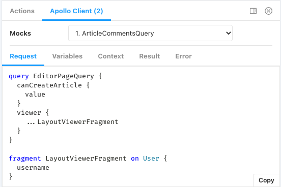

# Storybook Addon Apollo Client

Use Apollo Client in your Storybook stories.

This addon currently works with **React only**.

## Versions

- If you're using Apollo Client 2.x and Storybook 5.x use version 1.x
- If you're using Apollo Client 2.x or 3.x and Storybook 6.x use version 4.x
- If you're using Apollo Client 2.x or 3.x and Storybook 7.x use version 5.x

## Known issues

due to how MockedProvider works in Apollo, you will have to hard refresh when visiting sub stories (visiting stories that exist in the same file) to get the expected results, please upvote my comment here to see if we can get this fixed: https://github.com/apollographql/apollo-client/issues/9738#issuecomment-1606316338

## Install

**yarn**

```
yarn add --dev storybook-addon-apollo-client
```

**npm**

```
npm install -D storybook-addon-apollo-client
```

Add the addon to your configuration in `.storybook/main.js`

```js
module.exports = {
  ...config,
  addons: [
    ...your addons
    "storybook-addon-apollo-client",
  ],
};
```

add the following to your `.storybook/preview.js`

```js
import { MockedProvider } from '@apollo/client/testing'; // Use for Apollo Version 3+
// import { MockedProvider } from "@apollo/react-testing"; // Use for Apollo Version < 3

export const parameters = {
  apolloClient: {
    MockedProvider,
    // any props you want to pass to MockedProvider on every story
  },
};
```

## 5.0 Features
- added functionality to provide mocks within the `preview` using the new `globalMocks` key

```js
import { MockedProvider } from '@apollo/client/testing'; // Use for Apollo Version 3+
// import { MockedProvider } from "@apollo/react-testing"; // Use for Apollo Version < 3

export const preview = {
  parameters: {
    apolloClient: {
      MockedProvider,
      globalMocks: [
        // whatever mocks you want here
      ]
    }
  }
}
```

## Upgrading from a previous version

In previous versions, we had a decorator called `withApolloClient` this is no longer nesscessary. If you're upgrading from this API here are the following changes that you'll need to make:

1. remove all code referencing the deprecated withApolloClient decorator.
2. follow install instructions

## Writing your stories with queries

```jsx
import DashboardPage, { DashboardPageQuery } from '.';

export default {
  title: 'My Story',
};

export const Example = () => <DashboardPage />;

Example.parameters = {
  apolloClient: {
    // do not put MockedProvider here, you can, but its preferred to do it in preview.js
    mocks: [
      {
        request: {
          query: DashboardPageQuery,
        },
        result: {
          data: {
            viewer: null,
          },
        },
      },
    ],
  },
};
```

Read more about the options available for MockedProvider at https://www.apollographql.com/docs/react/development-testing/testing

### Usage

In Storybook, click "Show Addons" and navigate to the "Apollo Client" tab.



## Example App

To see real world usage of how to use this addon, check out the example app:

https://github.com/lifeiscontent/realworld

## Loading State

You can use the `delay` parameter to simulate loading state.

```
import DashboardPage, { DashboardPageQuery } from '.';

export default {
  title: 'My Story',
};

export const Example = () => <DashboardPage />;

Example.parameters = {
  apolloClient: {
    mocks: [
      {
        // Use `delay` parameter to increase loading time
        delay: 1e21,
        request: {
          query: DashboardPageQuery,
        },
        result: {
          data: {},
        },
      },
    ],
  },
};
```

## Error State

You can use the `error` parameter to create error state.

```
import DashboardPage, { DashboardPageQuery } from '.';

export default {
  title: 'My Story',
};

export const Example = () => <DashboardPage />;

Example.parameters = {
  apolloClient: {
    mocks: [
      {
        request: {
          query: DashboardPageQuery,
        },
        error: new Error('This is a mock network error'),
      },
    ],
  },
};
```
